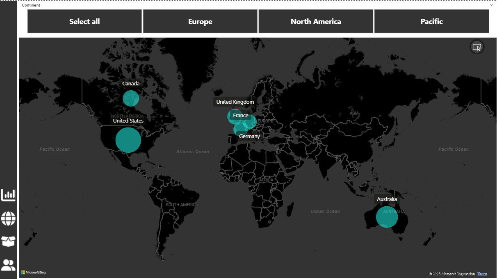

# 📊 AdventureWorks Sales Insights Dashboard

This Power BI project presents a comprehensive and interactive **Sales Analysis Dashboard** built using the AdventureWorks dataset. The dashboard is designed to empower business stakeholders with data-driven insights into **customer behavior**, **product performance**, **sales trends**, and **geographical analysis**.

---

## 📁 Project File

- **Power BI Template File**: [`Adventurework Sales Report.pbit`](./Adventurework%20Sales%20Report.pbit)

---

## 🖼 Dashboard Preview

| Customer Overview | Executive Summary | Product Insights |
|-------------------|-------------------|------------------|
|  |  |  |

| Geographic Map | Customer Demographics |
|----------------|------------------------|
|  |  |

---

## 📌 Key Features

- ✅ **Total Revenue, Profit, Orders, Return Rate** KPIs
- ✅ Monthly & Yearly **Revenue & Order Trends**
- ✅ Insights by **Income Level**, **Occupation**, and **Region**
- ✅ **Top Customers & Products** by Orders and Revenue
- ✅ **Return Trends** and **Most Returned Product Types**
- ✅ Interactive filters for **Year**, **Continent**, and **Product Name**

---

## 📈 Dashboard Pages Explained

### 1. **Executive Summary**
- Shows overall business performance:
  - Total Revenue: `$24.9M`
  - Profit: `$10.5M`
  - Orders: `25.2K`
  - Return Rate: `2.2%`
- Revenue & Order trends from 2020–2023
- Top ordered & returned product categories

### 2. **Customer Detail Report**
- Highlights total **unique customers** and **average retail price**
- Customer segments by:
  - **Income Level**
  - **Occupation**
- Top customers based on order count and revenue

### 3. **Customer Insight Report**
- Detailed analysis of top revenue-generating customers
- Monthly growth in customer acquisition
- Year filter slider to analyze time-based customer trends

### 4. **Product Detail Report**
- Product-level order, revenue, and return tracking
- Return % heatmap to highlight problematic products
- KPIs vs Targets: Orders, Revenue, Profit

### 5. **Geographical Report**
- **Map visualization** of customers by country and continent
- Drill-down by region: Europe, North America, Pacific
- Market penetration analysis

---

## 💡 Tools & Technologies

- Microsoft Power BI
- DAX Measures & Custom Visuals
- Data Modeling & Transformations
- AdventureWorks Sample Dataset

---

## 🎯 Objective

To help stakeholders **identify sales opportunities**, **understand customer profiles**, and **optimize product strategies** by leveraging interactive dashboards and KPIs.

---

## 📚 Learnings

- Advanced Power BI visualizations
- Effective storytelling with data
- Business-centric dashboard design
- Dynamic filtering and slicer controls

---

## 🧠 Insight Highlight

> **"Tires and Tubes"** emerged as both the **most ordered** and **most returned** product category – a critical area for operations review and quality assurance.

---

## 📬 Contact

**Author:** Arvind Goswami  
**Role:** Aspiring Data Analyst | Power BI Developer  

